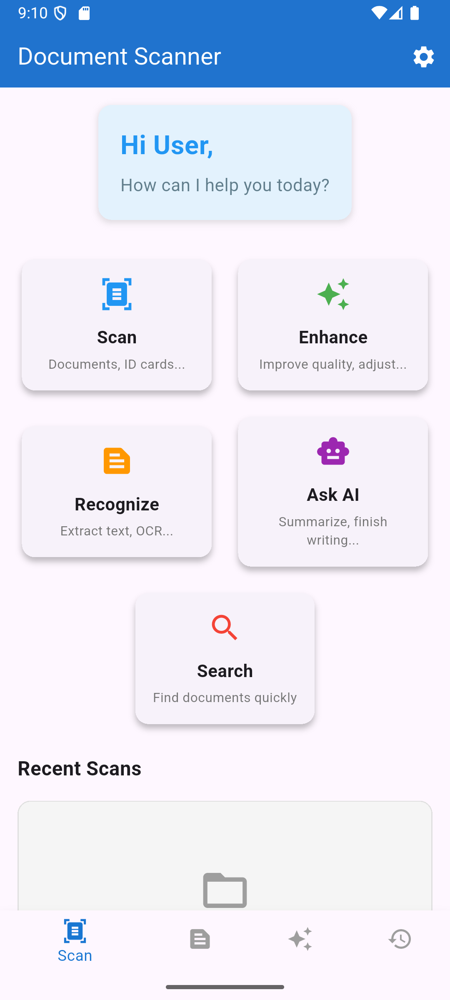

# 📷 SmartScan – OCR Scanner (Flutter, Google ML Kit)

SmartScan is a mobile app built with **Flutter** that uses **Google ML Kit** for advanced **OCR (Optical Character Recognition)**.  
It enables users to capture text from images, import from gallery, enhance recognition, and leverage AI features — all in a smooth, optimized experience.

---

## 🚀 Features
- 📸 **Image Capture** – Take pictures directly from the camera.  
- 🖼️ **Gallery Import** – Select existing images for OCR processing.  
- ✨ **Text Enhancement** – Improve accuracy and readability of extracted text.  
- 🔍 **Intelligent Search** – Quickly find recognized text snippets.  
- 🤖 **AI Integration** – Smarter text recognition and contextual improvements.  
- 🎨 **Clean UI** – Simple, modern, and user-friendly interface.  
- ⚡ **Optimized Performance** – Fast scanning with minimal lag.  

---

## 🛠️ Tech Stack
- **Flutter** – Cross-platform UI framework  
- **Google ML Kit** – OCR (Text Recognition)  
- **Dart** – Core language for development  

---

## 📸 Screenshots
<p align="center">
   
  
</p>

<p align="center">
   
</p>

---

## ⚙️ Installation & Setup
1. Clone the repository:
   ```bash
   git clone https://github.com/ibi865/SmartScan-OCR-Scanner-Flutter-Google-ML-Kit-.git
